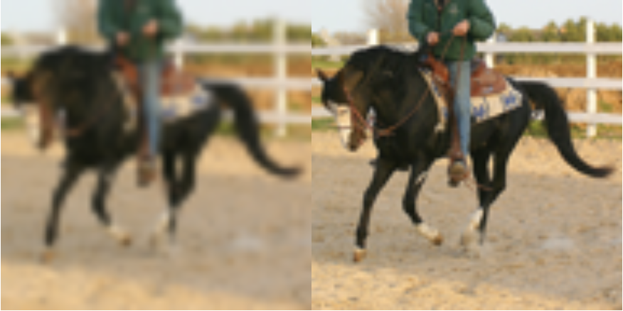

### テーマ

SRCNNモデルを用いた高解像度の画像への変換

### 使用したモデル

**SRCNN**

* super-resolution CNN の略称。
* 登場自体は2015年で、超解像度を目的とするCNNの中では比較的古く、小さいモデルになる。
* このネットワークでは入力される画像サイズと出力される画像サイズは同じである（拡大は行われない）
* その小ささからちゃんとしたGPUがなくても動くとのことで、今回採用した。
* 参照論文：https://arxiv.org/pdf/1501.00092.pdf

### 使用したデータセット

**STL-10**

* スタンフォード大学が公開している10クラスの画像データセット。
  * DL元サイト：https://cs.stanford.edu/~acoates/stl10/
  * 学習用データ、テスト用データ、ラベルなしデータに分かれている。
  * 学習用データは1クラスにつき500枚。
  * テストデータは1クラスにつき800枚。
  * ラベルなしデータは10万枚ある。
  * CIFAR10 と比較すると、画像サイズが96×96であるため、より鮮明なデータとして扱える 
* 今回はモデルに読み込ませる低解像度の画像を高解像度の画像から作成するため、 ある程度低解像度化しても元の画像の特徴が潰れにくくなることを期待して採用した。
* 提出の際にデータが大きくなりすぎるため、今回は元画像の学習用データ5000枚から500枚を選んで学習に使用した。
  * 5000枚使ったものについては結果だけ記載
* テストにはテストデータの最初の画像を1枚使用した。

## 低解像度の画像の準備について

* 元となる画像を縮小し、古典的な手法（今回はOpenCVのデフォルトであるバイリニア補間を採用）で拡大したものを 低解像度の画像として扱った

## 評価関数について

* PSNR（ピーク信号対雑音比）を採用
* 数式としては以下になり、30db以上であれば綺麗に見えるとのこと

